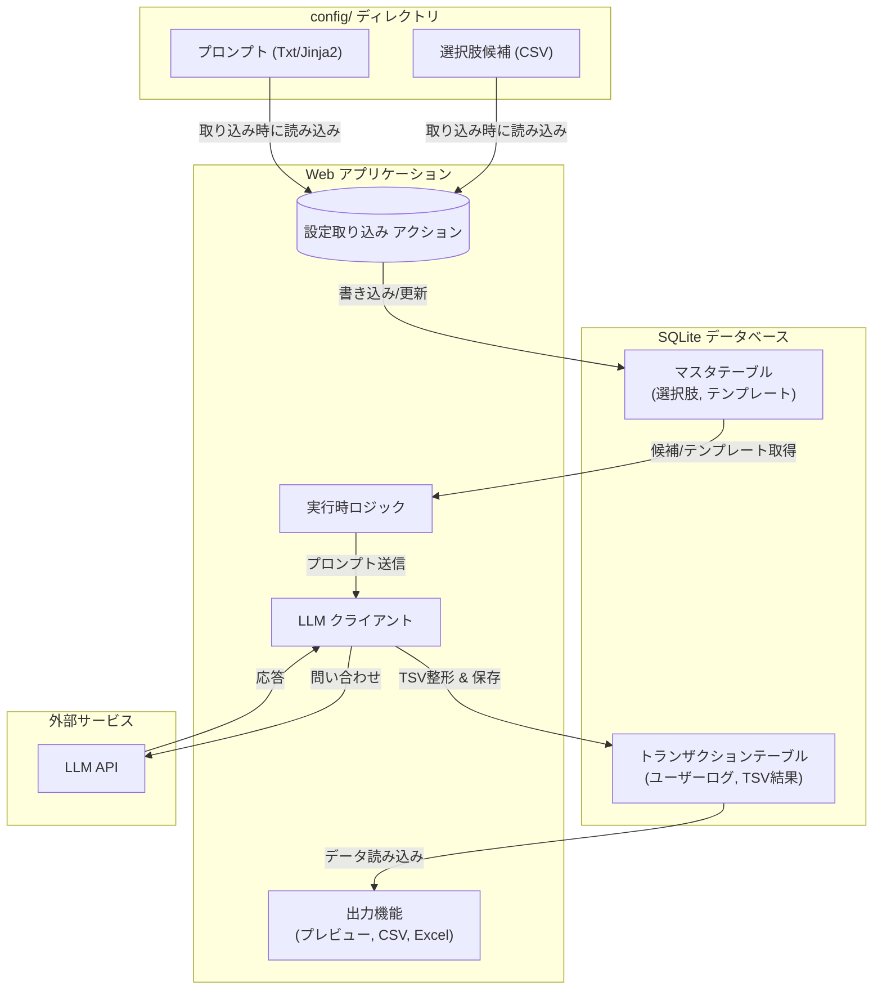

# システムアーキテクチャ

## 技術スタック

本システムの構築には、以下の技術スタックを採用しています（詳細は `docs/adr/` を参照）。

*   **言語**: Python 3.12
*   **Web フレームワーク**: FastAPI
*   **フロントエンド**: Jinja2 (テンプレート), HTMX (動的インタラクション), Pico CSS (スタイリング)
*   **データベース**: SQLite
*   **ORM**: SQLModel
*   **DB マイグレーション**: Atlas
*   **LLM オーケストレーション**: LangChain
*   **開発ツール**:
    *   **パッケージ管理**: uv
    *   **タスクランナー**: just
    *   **Lint/Format**: ruff, mypy
    *   **テスト**: pytest

## データフロー概要

本アプリケーションは、マスタデータおよびトランザクションデータの両方において **SQLite を中心とした**アーキテクチャを採用します。CSV やプロンプトなどの設定ファイルはマスタデータの初期ソースとして機能しますが、実行時にはデータベースに取り込まれたデータが使用されます。

### 1. マスタデータ管理 (設定)

*   **ソース**: Web サーバー上の `config/` ディレクトリ
    *   **選択肢候補**: CSV ファイルとして配置されます。
    *   **プロンプト**: テキストファイルまたはテンプレートファイルとして配置されます。
*   **取り込みメカニズム**:
    *   Web UI 上の特定の操作（例：「設定取り込み」ボタン）によってトリガーされます。
    *   アプリケーションは `config/` ディレクトリからファイルを読み込みます。
    *   読み込まれたデータは解析され、SQLite の **マスタテーブル** に Upsert（更新/挿入）されます。
*   **制約**: アプリケーションは、通常のユーザー操作（プロンプト生成、リクエスト処理など）の間は CSV/テキストファイルを **読み込みません**。これらにアクセスするのは、明示的な取り込み処理の間だけです。

### 2. 実行時データフロー

*   **選択肢/プロンプトの読み込み**:
    *   Web アプリケーションは、プロンプトテンプレートや選択肢候補を **SQLite のマスタテーブル** から直接取得します。
*   **ユーザーインタラクションと LLM 実行**:
    *   ユーザーは選択肢を選び、テキストを入力します。
    *   アプリケーションは、DB から取得したテンプレートとユーザー入力を組み合わせてプロンプトを構築し、**LLM に問い合わせ**を行います。
*   **結果の保存と活用**:
    *   LLM からの応答は **TSV (Tab-Separated Values) 形式** に整理され、**SQLite のトランザクションテーブル** に保存されます。
    *   保存された TSV データをもとに、以下の機能が提供されます：
        *   **プレビュー表示**: Web UI 上での結果確認
        *   **CSV ダウンロード**: カンマ区切り形式でのエクスポート
        *   **Excel ダウンロード**: `.xlsx` 形式でのエクスポート

## アーキテクチャ図

